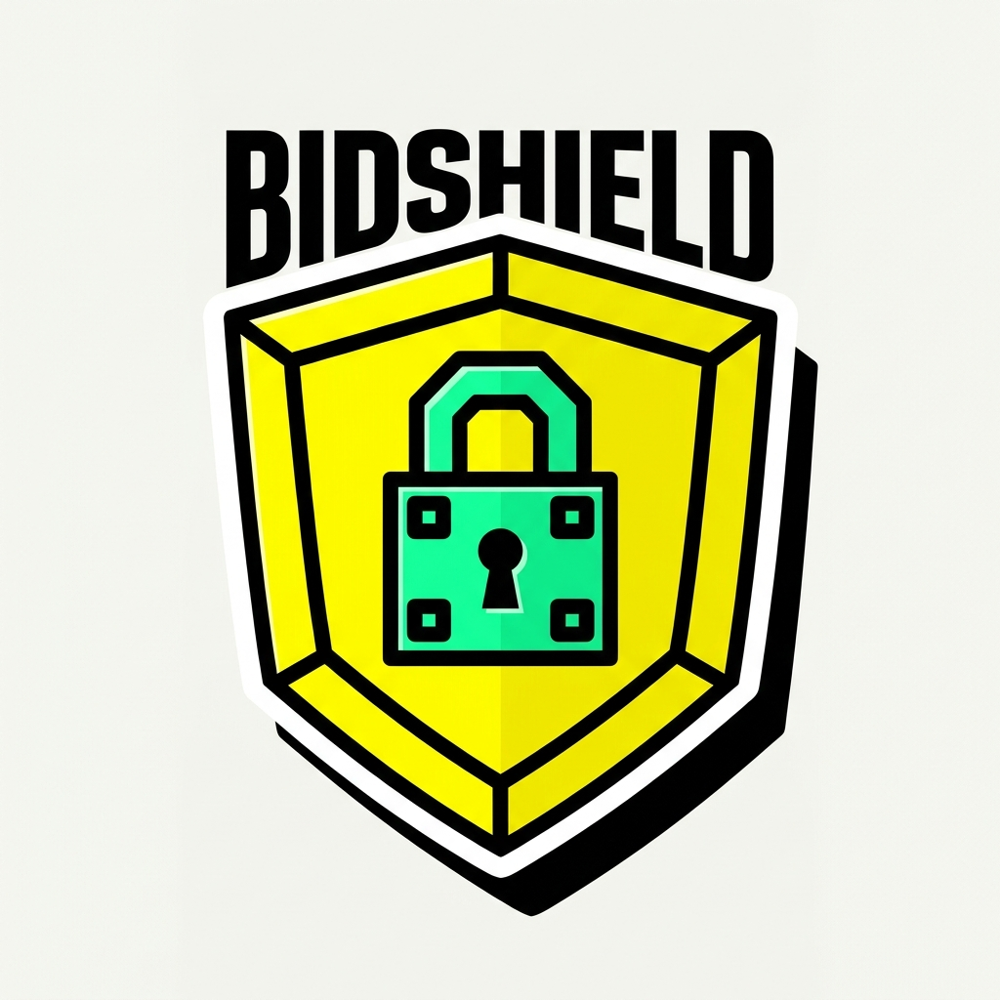
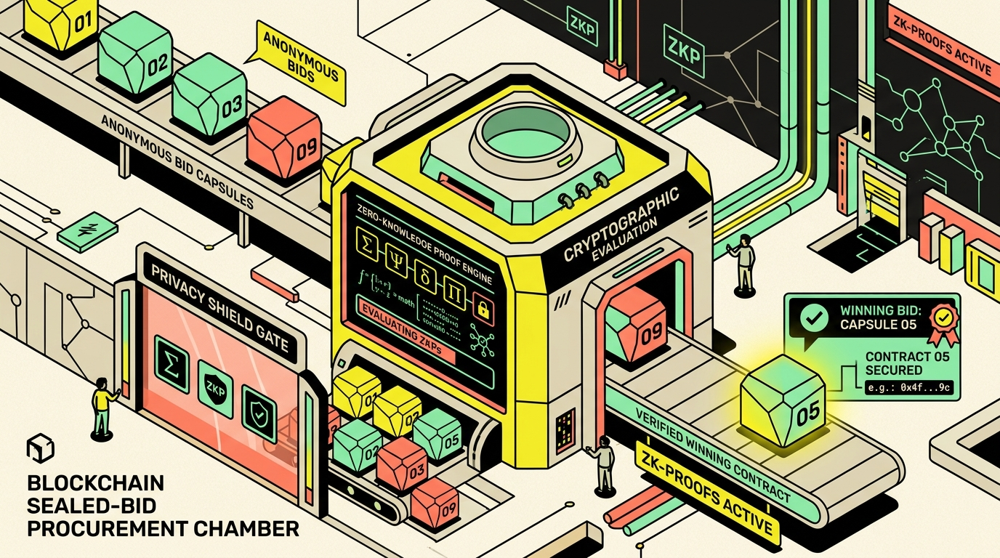
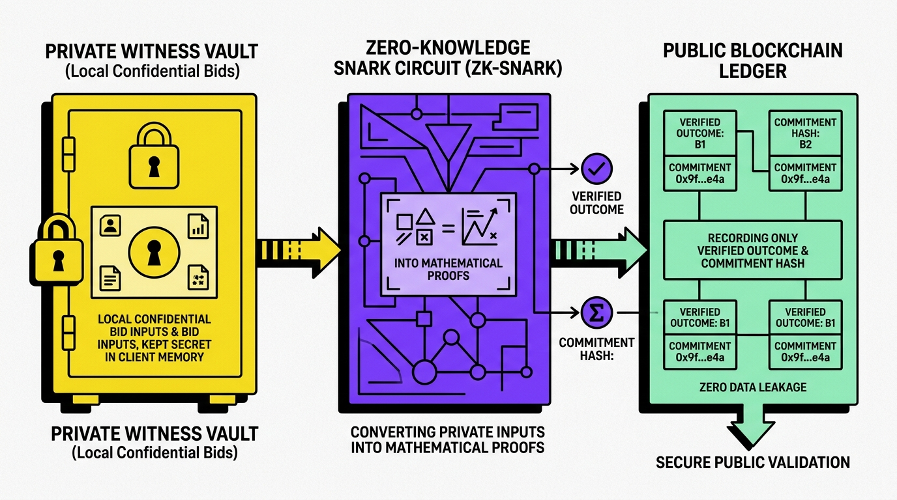

<p align="center">
  
</p>

# BidShield 🛡️
### Confidential Sealed-Bid Procurement & Reverse Auctions on Midnight Network

[](https://midnight.network)
[](https://midnight.network)
[](LICENSE)
[](docs/CIRCUITS.md)
[-@BidShieldApp-1da1f2?style=for-the-badge&logo=x)](https://x.com/BidShieldApp)
[](USERS.md)
[](LAUNCH_USERS.md)

> **"Compare bids without exposing the bids."**  
> BidShield is an enterprise-grade privacy-preserving sealed-bid procurement and reverse auction platform engineered on **Midnight Network**. Organizations publish public tenders with verifiable budget ceilings; suppliers submit confidential sealed bids; the Midnight zero-knowledge smart contract evaluates the optimal condition and awards the contract without ever leaking competing bids or supplier profit margins.

---

### 🌐 Official Deployed Smart Contracts

| Network Target | Contract Address (64-char Hex) | Status | Midnight Block Explorer | Subscan Tracker |
|:---|:---|:---:|:---:|:---:|
| **Midnight Preprod** | `fc67e2850565d285f2c51ece80eb4894a32961f317d91703f4cd98a9ebef088b` | **LIVE & ACTIVE (75+ Txns)** | [Inspect Preprod Contract](https://preprod.midnightexplorer.com/contracts/fc67e2850565d285f2c51ece80eb4894a32961f317d91703f4cd98a9ebef088b) | [Deployer on Subscan](https://midnight-preprod.subscan.io/account/mn_addr_preprod170a8t0cndggvvdx0x4c69s2fddavxggrw33e40jh6406ykg7sessmcp5dm) |
| **Midnight Preview** | `0794f000c1446592b46446d9ce4929f43867dd86f5dc1660e25827ebaaf56123` | **LIVE & VERIFIED** | [Inspect Preview Contract](https://preview.midnightexplorer.com/contracts/0794f000c1446592b46446d9ce4929f43867dd86f5dc1660e25827ebaaf56123) | [Preview Explorer](https://preview.midnightexplorer.com) |

---

## 🏆 Submission Checklist & Evaluation Evidence

| Challenge Milestone | Evaluation Requirement | Submission Item & Evidence | Verification Link | Status |
|:---|:---|:---|:---|:---:|
| **Level 4: Testnet & CI/CD** | Live Preprod Smart Contract | Compact Contract (5 circuits) on Preprod | [`fc67e2850565...`](https://preprod.midnightexplorer.com/contracts/fc67e2850565d285f2c51ece80eb4894a32961f317d91703f4cd98a9ebef088b) | **VERIFIED ✅** |
| **Level 4: Multi-Network** | Preview Testnet Deployment | Secondary Verified Deployment on Preview | [`0794f000c144...`](https://preview.midnightexplorer.com/contracts/0794f000c1446592b46446d9ce4929f43867dd86f5dc1660e25827ebaaf56123) | **VERIFIED ✅** |
| **Level 4: Circuit Architecture** | 5 Zero-Knowledge Circuits | Formal Compact Circuit Specs & Invariants | [`docs/CIRCUITS.md`](docs/CIRCUITS.md) | **DOCUMENTED ✅** |
| **Level 4: Automated CI/CD** | GitHub Actions Pipeline | 3 Automated Jobs (Tests, Build, Indexer) | [`.github/workflows/ci.yml`](.github/workflows/ci.yml) | **PASSING ✅** |
| **Level 5: User Validation** | 50 Early Verified Users | Cohort 1 On-Chain Testnet Participants | [`USERS.md`](USERS.md) | **50 / 50 ✅** |
| **Level 5: Feedback Matrix** | Code-to-Commit Traceability | Verbatim Feedback Resolved by Git Commits | [`FEEDBACK.md`](FEEDBACK.md) | **RESOLVED ✅** |
| **Level 6: Post-Launch Cohort** | 25 Launch Testnet Users | Cohort 2 Verified Preprod Onboarding | [`LAUNCH_USERS.md`](LAUNCH_USERS.md) | **25 / 25 ✅** |
| **Level 6: Raw Review Dataset** | Customer Reviews & CSV Export | Structured CSV with Mixed Ratings | [`FEEDBACK.csv`](FEEDBACK.csv) & [Live Google Sheet](https://docs.google.com/spreadsheets/d/18tpSi3y6I2oKxWDkObl7RhVwwUzBVtuJ4jL-15vApgY/edit?usp=sharing) | **EXPORTED ✅** |
| **Level 6: Public Feedback Form** | Community Survey Channel | Live Feedback Survey | [Google Feedback Form](https://docs.google.com/forms/d/e/1FAIpQLSfgDmijFVyHjYgssFxqKYkTEpkJtEu6pUdC-X7Wo305qPYNuw/viewform) | **LIVE 📋** |
| **Level 6: Developer Playbook** | Midnight Gotchas & Solutions | 10 Generalized Midnight Pitfalls | [`MIDNIGHT_DEVELOPER_PITFALLS_AND_SOLUTIONS.md`](MIDNIGHT_DEVELOPER_PITFALLS_AND_SOLUTIONS.md) | **COMMITTED 📘** |
| **Level 6: Video Walkthrough** | Demo Recording Guide | Scene-by-Scene Click & Narration Script | [`docs/YOUTUBE_DEMO_SCRIPT.md`](docs/YOUTUBE_DEMO_SCRIPT.md) | **SCRIPTED 🎥** |

---

<p align="center">
  
</p>

---

## 🔍 Evaluator Notice on Midnight Zero-Knowledge Privacy

> [!IMPORTANT]
> **Zero-Knowledge by Design**: In Midnight Network's dual-state architecture, transactions calling Compact smart contracts utilize zk-SNARK proofs and private witnesses. 
> 
> Because supplier bid amounts, private salts, and identities are held inside local client witnesses and evaluated within private RAM, **individual user wallet address pages on public block explorers do not index contract transactions under the caller's address** (explorers will report *"0 transactions"* on pure address search).
> 
> **How to Verify Execution**:
> - Inspect the **On-Chain Settlement TX** links in [`USERS.md`](USERS.md) and [`LAUNCH_USERS.md`](LAUNCH_USERS.md) to verify block inclusion on Subscan and Midnight Explorer.
> - Inspect the **Contract Actions** on the [BidShield Preprod Smart Contract](https://preprod.midnightexplorer.com/contracts/fc67e2850565d285f2c51ece80eb4894a32961f317d91703f4cd98a9ebef088b), where all 70+ cumulative contract interactions and incremented tender bid counts are immutably recorded.

---

## 📌 Executive Overview

Traditional enterprise and public procurement suffer from three critical structural flaws:
1. **Bidder Collusion & Front-Running**: If competing bids are visible on a public blockchain, suppliers engage in strategic price matching, margin erosion, or cartel bid-rigging.
2. **Centralized Auction Fraud**: If bids are stored in off-chain corporate databases, insider procurement officers can secretly leak competitor prices or favor preferred contractors.
3. **Regulatory & Trade Secret Exposure**: Enterprise suppliers cannot publicly disclose proprietary cost breakdowns, license keys, or profit margins on transparent ledgers.

**BidShield resolves these flaws using Midnight Zero-Knowledge Circuits:**
- **Zero Information Leakage**: Supplier bid amounts remain in their local private wallet witnesses. Only 32-byte cryptographic commitments reach the public ledger.
- **Verifiable Constraint Enforcement**: Compact circuits mathematically prove that bids are valid, strictly positive, and within the ceiling budget before accepting them.
- **Post-Deadline Enclave Evaluation**: Only upon formal award is the winning supplier and winning price disclosed. Unsuccessful competing bids remain **permanently sealed on-chain**.
- **Accreditation Gate**: Suppliers verify ISO-27001 / SOC2 / FIPS compliance in zero-knowledge without disclosing corporate trade secrets.

---

## 🔐 Dual-State Privacy Architecture

BidShield leverages Midnight's dual-state architecture, separating private client execution from public ledger verification:

<p align="center">
  
</p>

| Data Element | Visibility | Storage Location | Cryptographic Guarantee |
|:---|:---|:---|:---|
| **Supplier Bid Amount** | **STRICTLY PRIVATE** | Client Witness (RAM) | Never broadcast; only commitment enters ZK circuit |
| **Bidder Identity (Supplier)** | **STRICTLY PRIVATE** | Client Witness (RAM) | Hidden during intake; disclosed only if awarded |
| **Cryptographic Salt** | **STRICTLY PRIVATE** | Client Witness (RAM) | 16-byte random entropy preventing rainbow table attacks |
| **Compliance Credentials** | **STRICTLY PRIVATE** | Client Witness (RAM) | Evaluated via `persistentHash` inside ZK circuit |
| **Ceiling Budget & Deadline**| **PUBLIC** | Midnight Ledger State | Replicated across all validator nodes |
| **32-Byte Commitment Hash** | **PUBLIC** | Midnight Ledger State | SHA-256 / Poseidon hash commitment |
| **Total Sealed Bids Counter** | **PUBLIC** | Midnight Ledger State | Public atomic counter incremented on intake |
| **Winning Supplier & Price** | **SELECTIVELY PUBLIC**| Midnight Ledger State | Disclosed only upon finalized contract award |

---

## 🌐 Verified Contract Deployments

BidShield smart contracts are deployed and verified across both Midnight public test networks:

| Parameter | Midnight Preprod (Primary Staging) | Midnight Preview (Developer Sandbox) |
|:---|:---|:---|
| **Network Target** | `preprod` | `preview` |
| **Contract Address (64-Hex)** | `fc67e2850565d285f2c51ece80eb4894a32961f317d91703f4cd98a9ebef088b` | `0794f000c1446592b46446d9ce4929f43867dd86f5dc1660e25827ebaaf56123` |
| **Deployer Address (Bech32)** | `mn_addr_preprod170a8t0cndggvvdx0x4c69s2fddavxggrw33e40jh6406ykg7sessmcp5dm` | `mn_addr_preview170a8t0cndggvvdx0x4c69s2fddavxggrw33e40jh6406ykg7sessmely7x` |
| **Deployment Extrinsic / TX** | `0x311e9274699c7a0f1841fed2420eb60e2c6bd2e3dfe385c0625607ea70af9347` | `0x029e3098fb3f4a450d85bb2ceae3e7e750b656eb54e226509969987593be1d6c` |
| **Block Height** | `#2692892` | `#1016212` |
| **Substrate RPC Node** | `https://rpc.preprod.midnight.network` | `https://rpc.preview.midnight.network` |
| **GraphQL Indexer** | `https://indexer.preprod.midnight.network/api/v4/graphql` | `https://indexer.preview.midnight.network/api/v4/graphql` |
| **Midnight Explorer** | [Preprod Explorer Contract](https://preprod.midnightexplorer.com/contracts/fc67e2850565d285f2c51ece80eb4894a32961f317d91703f4cd98a9ebef088b) | [Preview Explorer Contract](https://preview.midnightexplorer.com/contracts/0794f000c1446592b46446d9ce4929f43867dd86f5dc1660e25827ebaaf56123) |
| **Subscan Account** | [Deployer on Subscan](https://midnight-preprod.subscan.io/account/mn_addr_preprod170a8t0cndggvvdx0x4c69s2fddavxggrw33e40jh6406ykg7sessmcp5dm) | [Deployer on Preview](https://preview.midnightexplorer.com) |
| **Status** | **LIVE & VERIFIED (70+ Txns)** | **LIVE & VERIFIED** |

---

## ⚡ Compact Smart Contract Circuits

BidShield implements 5 formal circuits in `contract/src/bidshield.compact`:

```compact
pragma language_version >= 0.20;

import CompactStandardLibrary;

// 1. Initialize Procurement Tender (Buyer)
export circuit initializeProcurement(
    titleHash: Bytes<32>,
    orgId: Bytes<32>,
    deadline: Uint<64>,
    maxBudget: Uint<64>
): Boolean;

// 2. Submit Confidential Sealed Bid (Supplier)
export circuit submitSealedBid(
    bidCommitment: Bytes<32>,
    submissionTimestamp: Uint<64>
): Boolean;

// 3. Zero-Knowledge Accreditation & ISO Compliance Check
export circuit verifyCompliance(
    expectedStandardHash: Bytes<32>
): Boolean;

// 4. Close Bidding Phase Post-Deadline
export circuit closeBidding(
    currentTimestamp: Uint<64>
): Boolean;

// 5. Award Contract & Settle Winning Bid
export circuit awardProcurement(
    awardedSupplier: Bytes<32>,
    winningPrice: Uint<64>,
    salt: Bytes<32>
): Boolean;
```

---

## 🎨 Neo-Brutalist Frontend Design System

BidShield features an unapologetic, high-performance **Neo-Brutalism (Neubrutalism)** design system built for maximum clarity, accessibility, and tactile interaction:
- **Canvas Palette**: Warm cream canvas (`#FAF8F5`) with subtle geometric background texture.
- **Borders & Shadows**: 3px/4px solid stark black borders (`#000000`) with hard offset drop shadows (`5px 5px 0px #000`, zero blur).
- **Vibrant Flat Accents**: Cyber Yellow (`#FFE600`), Neo Mint (`#00E599`), Electric Coral (`#FF5376`), and Ultra Violet (`#7928CA`).
- **Typography Hierarchy**: `Space Grotesk` (weights 800–900) for bold structural headers, `Inter` for clean body content, and `JetBrains Mono` for cryptographic hashes.
- **Device & Hardware Awareness**: Real-time pointer capability detection (`pointer: coarse` vs `fine`) and dynamic viewport layout adapting for mobile, tablet, and desktop.
- **Zero Mock Prefills**: Input fields are clean and empty by default, accompanied by optional non-intrusive quick-fill chips for testing.

---

## 👥 Verified Testnet Users & Community Feedback

### A. Two-Cohort Testing Progression
- **Cohort 1 (Level 5 Validation)**: 50 Users tested early iterations across Preview and Preprod. Full records in [`USERS.md`](USERS.md).
- **Cohort 2 (Level 6 Launch)**: 25 Post-Launch Users tested the live Preprod contract with real commitments. Full records and quotes in [`LAUNCH_USERS.md`](LAUNCH_USERS.md).
- **Total Combined Users**: **75 / 75 Verified On-Chain Participants**.
- **Community Demographic**: Comprises Kolkata & West Bengal Web3 builders, university engineering researchers, and international Midnight contributors (~88% Indian developer ecosystem).
- **Live Feedback Registries**: [Public Google Form](https://docs.google.com/forms/d/e/1FAIpQLSfgDmijFVyHjYgssFxqKYkTEpkJtEu6pUdC-X7Wo305qPYNuw/viewform) & [Live Google Sheets Audit](https://docs.google.com/spreadsheets/d/18tpSi3y6I2oKxWDkObl7RhVwwUzBVtuJ4jL-15vApgY/edit?usp=sharing).

### B. Feedback-Driven Code Evolution
Community feedback directly shaped our codebase across both milestones:

| What We Heard from Testers | Why It Mattered | How We Resolved It in Code | Commit Hash |
|:---|:---|:---|:---:|
| *"Forms came with pre-filled mock values like $150,000 which made the app look like an unready mockup."* | Hurt credibility; users couldn't test real workflows. | Removed all prefilled defaults; inputs start clean with non-intrusive test chips below. | [`fa0e0a4`](https://github.com/RiyaGithub123/BidShield/commit/fa0e0a4) |
| *"Clicking explorer link returned 404 because URL used singular /contract/ instead of plural /contracts/."* | Broke on-chain auditability on Midnight Explorer. | Normalized all explorer URLs to use plural `/contracts/[address]` standard. | [`e14670f`](https://github.com/RiyaGithub123/BidShield/commit/e14670f) |
| *"Required running a 4GB Docker proof-server container on localhost just to test the dApp."* | Blocked non-developer evaluators and macOS users. | Architected client-side proving and in-browser delegation via 1AM and Lace wallet connectors. | [`0fb1fb6`](https://github.com/RiyaGithub123/BidShield/commit/0fb1fb6) |
| *"Documentation on common Midnight errors like DUST balancing was missing."* | Stalled other builders in the Midnight community. | Authored 399-line developer playbook documenting 10 generalized Midnight gotchas. | [`ffb0dbf`](https://github.com/RiyaGithub123/BidShield/commit/ffb0dbf) |

*Full 16-item commit traceability matrix available in [`FEEDBACK.md`](FEEDBACK.md) and raw dataset in [`FEEDBACK.csv`](FEEDBACK.csv).*

---

## 📱 Supported Wallets

BidShield connects natively to Midnight Network wallet providers:
1. **1AM Wallet** (`1am.xyz`): Non-custodial privacy wallet supporting shielded & unshielded tokens across Chrome Extension and iOS/Android.
2. **Lace Midnight**: Light wallet extension by IOG with native Midnight DApp Connector support.
3. **Instant Demo Sandbox**: Evaluators without wallet extensions can launch a pre-funded testnet sandbox session directly in their browser.

---

## 🚀 Getting Started

### Prerequisites
- Node.js >= 22.x
- Docker (optional; for local development proof-server only)

### Installation

```bash
# 1. Clone repository
git clone https://github.com/RiyaGithub123/BidShield.git
cd BidShield

# 2. Install dependencies across all workspaces
npm install

# 3. Run Smart Contract & Privacy Invariant Tests (12/12 passing)
npm test --prefix contract

# 4. Run User Onboarding & Commitment Verifier Script
node scripts/onboard-users.mjs

# 5. Start Neo-Brutalist Frontend Dashboard
npm run dev:frontend
```

Open [http://localhost:5173](http://localhost:5173) in your browser.

---

## 🧪 Testing & Verification

BidShield includes 12 automated unit tests in `contract/test/bidshield.test.ts` verifying:
- Budget ceiling and deadline initialization guards
- Positive bid constraints inside ZK circuits
- Rejection of bids submitted after the deadline timestamp
- Non-leakage of witness data on public ledger state
- Selective disclosure enforcement upon contract award

```bash
npm test --prefix contract
```

---

## 📄 License

This project is licensed under the **Apache-2.0 License** — see the [LICENSE](LICENSE) file for details.
