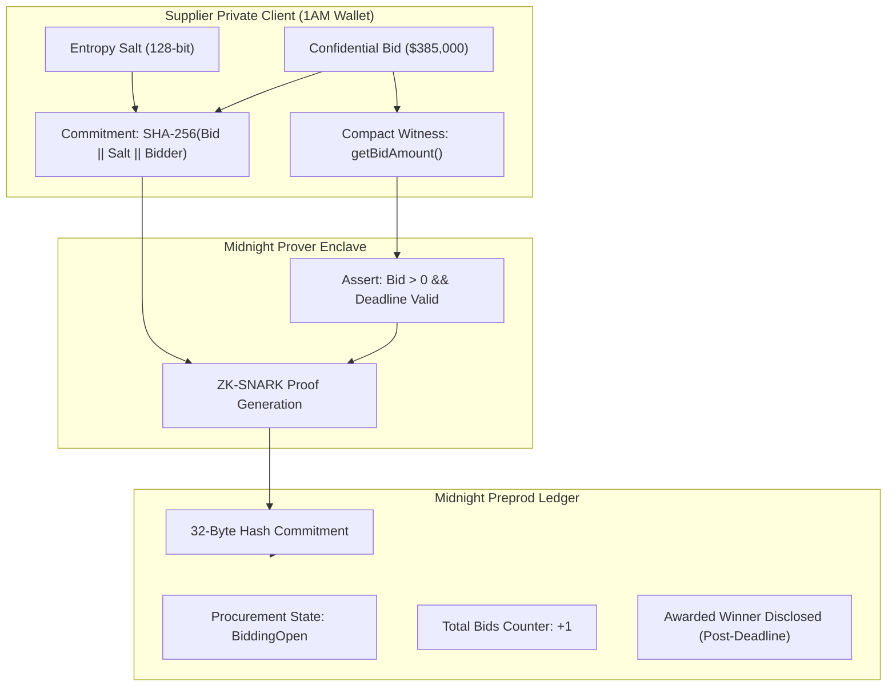
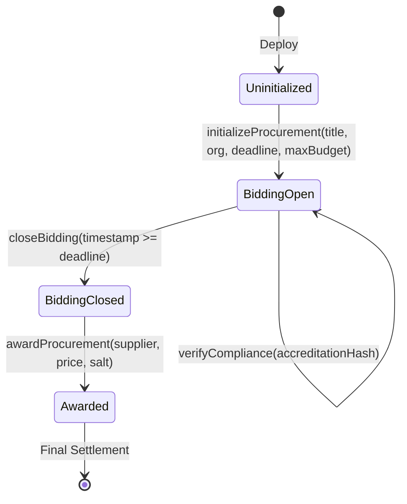

# BidShield Technical Architecture Document

## 1. System Overview

BidShield is a zero-knowledge confidential procurement platform that provides end-to-end privacy for reverse auctions and sealed bidding on the **Midnight Network**.

The protocol bridges three distinct computational environments:
1. **Supplier Private Enclave (Client/Browser)**: Where private bids, random cryptographic salts, and enterprise accreditation credentials are stored and evaluated via local Compact witness functions.
2. **Midnight Zero-Knowledge Proof Layer**: Where proofs of circuit satisfiability (`submitSealedBid`, `verifyCompliance`, `awardProcurement`) are generated using client-side or local proof servers before reaching consensus.
3. **Midnight Public Ledger**: Where only public RFP metadata, commitment hashes, bid counts, and final disclosed winning bids are committed.



---

## 2. State Machine Transitions

The BidShield smart contract manages a deterministic state machine:



### State Definitions:
- `0: Uninitialized`: Contract deployed; awaiting procurement parameter definition.
- `1: BiddingOpen`: Accepting sealed-bid cryptographic commitments. Supplier witnesses run locally.
- `2: BiddingClosed`: Submission deadline has passed. Bidding intake halted; evaluation phase begins.
- `3: Awarded`: Winning supplier verified against budget ceiling. Winning bid and supplier disclosed; contract settled.

---

## 3. Compact Smart Contract Data Structures

### Public Ledger State
```compact
export ledger procurementState: Uint<64>;      // 0: Uninit, 1: Open, 2: Closed, 3: Awarded
export ledger procurementId: Bytes<32>;         // RFP identifier
export ledger organizationId: Bytes<32>;        // Enterprise issuer
export ledger submissionDeadline: Uint<64>;     // Unix epoch deadline
export ledger ceilingBudget: Uint<64>;          // Maximum budget ceiling
export ledger totalBidsSubmitted: Uint<64>;     // Public bid count
export ledger winningBidderId: Bytes<32>;       // Disclosed only upon award
export ledger winningAmount: Uint<64>;          // Disclosed winning price
export ledger isComplianceVerified: Boolean;    // ZK compliance passed
```

### Private Off-Chain Witnesses
```compact
witness getBidAmount(): Uint<64>;
witness getBidSalt(): Bytes<32>;
witness getBidderIdentity(): Bytes<32>;
witness getComplianceCredential(): Bytes<32>;
```
