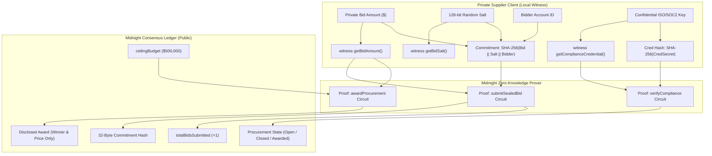

# BidShield Zero-Knowledge Circuit Documentation 🛡️

BidShield implements a state-of-the-art confidential sealed-bid procurement and reverse auction protocol written in **Midnight Compact** (`pragma language_version >= 0.23.0`).

This document provides a deep architectural and cryptographic specification of the five zero-knowledge circuits, private off-chain witnesses, public ledger states, and mathematical invariants powering BidShield.

---

## 📐 Zero-Knowledge Circuit Architecture

Midnight Network separates computation into two realms:
1. **Private Client Enclave (Off-Chain)**: Evaluates witness functions in local WebAssembly/private RAM. Private bid amounts, random 128-bit cryptographic salts, and trade-secret compliance credentials never leave the user's device.
2. **Public Ledger (On-Chain Consensus)**: Records immutable contract state transitions, cryptographic commitments (hashes), public bid counters, and post-award disclosures.



---

## 🏛️ Public Ledger State Variables

The following state is publicly stored and observable on the Midnight Preprod and Preview ledgers:

```compact
export ledger procurementState: Uint<64>;      // 0: Uninitialized, 1: BiddingOpen, 2: BiddingClosed, 3: Awarded
export ledger procurementId: Bytes<32>;         // Hash identifier of procurement RFP / auction
export ledger organizationId: Bytes<32>;        // Organization / enterprise issuer ID
export ledger submissionDeadline: Uint<64>;     // Unix timestamp deadline for sealed bids
export ledger ceilingBudget: Uint<64>;          // Maximum budget ceiling for procurement
export ledger totalBidsSubmitted: Uint<64>;     // Total number of sealed bids received
export ledger winningBidderId: Bytes<32>;       // Identity of awarded supplier (disclosed at award)
export ledger winningAmount: Uint<64>;          // Winning contract price (disclosed at award)
export ledger isComplianceVerified: Boolean;    // Zero-knowledge proof of regulatory/ISO compliance passed
```

---

## 🔐 Private Off-Chain Witness Declarations

Witness functions run strictly on the bidder's local client inside the Midnight DApp connector / 1AM Wallet. They provide private inputs directly to circuit evaluation without writing them to blockchain storage:

```compact
witness getBidAmount(): Uint<64>;
witness getBidSalt(): Bytes<32>;
witness getBidderIdentity(): Bytes<32>;
witness getComplianceCredential(): Bytes<32>;
```

---

## ⚙️ Detailed Circuit Specifications

### Circuit 1: `initializeProcurement`
* **Role**: Buyer / Procuring Organization (e.g. Enterprise Treasury, DAO, Municipal Agency).
* **Purpose**: Deploys a new procurement tender with a public ceiling budget, a cryptographic title hash, and an absolute block timestamp deadline.
* **Pre-conditions & Assertions**:
  1. `procurementState == 0 || procurementState == 3`: Can only initialize when uninitialized or when a prior tender is settled.
  2. `deadline > 0`: Deadline must be an absolute timestamp in the future.
  3. `maxBudget > 0`: Ceiling budget must be strictly positive.
* **Ledger State Transitions**:
  - `procurementState` -> `1` (`BiddingOpen`).
  - `procurementId` -> `disclose(titleHash)`.
  - `submissionDeadline` -> `disclose(deadline)`.
  - `ceilingBudget` -> `disclose(maxBudget)`.
  - `totalBidsSubmitted` -> `0`.
  - `isComplianceVerified` -> `false`.

```compact
export circuit initializeProcurement(
    titleHash: Bytes<32>,
    orgId: Bytes<32>,
    deadline: Uint<64>,
    maxBudget: Uint<64>
): Boolean {
    assert(procurementState == 0 || procurementState == 3, "Procurement tender is currently active");
    assert(deadline > 0, "Deadline must be in the future");
    assert(maxBudget > 0, "Budget ceiling must be greater than zero");

    procurementId = disclose(titleHash);
    organizationId = disclose(orgId);
    submissionDeadline = disclose(deadline);
    ceilingBudget = disclose(maxBudget);
    totalBidsSubmitted = 0;
    winningBidderId = pad(32, "");
    winningAmount = 0;
    isComplianceVerified = false;
    procurementState = 1; // Transition to BiddingOpen

    return true;
}
```

---

### Circuit 2: `submitSealedBid`
* **Role**: Supplier / Bidder.
* **Purpose**: Submits a sealed cryptographic bid commitment while keeping the financial bid amount 100% confidential.
* **Privacy Guarantees**:
  - The bid price (`getBidAmount()`) is asserted to be strictly positive (`assert(privateBid > 0)`) **entirely within private RAM**.
  - The transaction broadcasted to Midnight consensus contains **only the 32-byte SHA-256 commitment** `SHA-256(bidAmount || salt || bidderAddress)`.
  - Public observers see only `totalBidsSubmitted` increment by `1`.
* **Pre-conditions & Assertions**:
  1. `procurementState == 1`: Bidding must be currently open.
  2. `submissionTimestamp <= submissionDeadline`: Submission must occur prior to deadline.
  3. `getBidAmount() > 0`: Private witness assertion preventing zero or negative bids.

```compact
export circuit submitSealedBid(
    bidCommitment: Bytes<32>,
    submissionTimestamp: Uint<64>
): Boolean {
    assert(procurementState == 1, "Bidding window is not open");
    assert(submissionTimestamp <= submissionDeadline, "Procurement submission deadline has passed");

    // Supplier's private witness validation: bid amount must be within realistic bounds
    const privateBid = getBidAmount();
    assert(privateBid > 0, "Bid amount must be strictly positive");

    totalBidsSubmitted = disclose((totalBidsSubmitted + 1) as Uint<64>);
    return true;
}
```

---

### Circuit 3: `verifyCompliance`
* **Role**: Supplier / Bidder.
* **Purpose**: Mathematically proves that the supplier possesses accredited regulatory qualifications (e.g. ISO-27001, SOC2 Type II, HIPAA, FIPS 140-3) **without disclosing confidential corporate audit documents, trade secrets, or unredacted PDF certificates**.
* **Zero-Knowledge Mechanism**:
  - The supplier provides a private credential secret through `getComplianceCredential()`.
  - The circuit computes `persistentHash<Bytes<32>>(credentialSecret)` in private RAM.
  - The circuit asserts equality against the public RFP `expectedAccreditationHash`.
  - Upon proof verification, `isComplianceVerified` transitions to `true`.

```compact
export circuit verifyCompliance(
    expectedAccreditationHash: Bytes<32>
): Boolean {
    assert(procurementState == 1 || procurementState == 2, "Cannot verify compliance in current state");

    const credentialSecret = getComplianceCredential();
    const computedHash = persistentHash<Bytes<32>>(credentialSecret);

    assert(computedHash == expectedAccreditationHash, "Supplier compliance credentials do not meet RFP standards");
    isComplianceVerified = true;
    return true;
}
```

---

### Circuit 4: `closeBidding`
* **Role**: Procurement Officer / Automation Bot / Timekeeper.
* **Purpose**: Enforces the tender submission window deadline, freezing bid intake and transitioning the procurement into evaluation mode.
* **Pre-conditions & Assertions**:
  1. `procurementState == 1`: Tender must currently be open.
  2. `currentTimestamp >= submissionDeadline`: Cannot close bidding prematurely.
* **Ledger State Transitions**:
  - `procurementState` -> `2` (`BiddingClosed`).

```compact
export circuit closeBidding(
    currentTimestamp: Uint<64>
): Boolean {
    assert(procurementState == 1, "Bidding is not open");
    assert(currentTimestamp >= submissionDeadline, "Cannot close bidding before deadline");

    procurementState = 2; // Transition to BiddingClosed
    return true;
}
```

---

### Circuit 5: `awardProcurement`
* **Role**: Evaluator / Procurement Officer / Buyer.
* **Purpose**: Evaluates winning sealed bid criteria and awards the contract to the lowest qualified supplier.
* **Selective Disclosure Guarantee**:
  - The winning supplier and the winning contract price are verified against the budget ceiling (`assert(awardedPrice <= ceilingBudget)`).
  - The identity witness is verified (`assert(bidderIdentity == awardedSupplier)`).
  - **Only the winning supplier and price are disclosed on-chain.**
  - **All losing competitor bids, private margins, and unselected quotes remain completely sealed in zero-knowledge forever!**
* **Ledger State Transitions**:
  - `winningBidderId` -> `disclose(awardedSupplier)`.
  - `winningAmount` -> `disclose(awardedPrice)`.
  - `procurementState` -> `3` (`Awarded`).

```compact
export circuit awardProcurement(
    awardedSupplier: Bytes<32>,
    awardedPrice: Uint<64>,
    bidSalt: Bytes<32>
): Boolean {
    assert(procurementState == 2, "Bidding must be closed before awarding");
    assert(awardedPrice <= ceilingBudget, "Winning bid exceeds procurement ceiling budget");
    assert(awardedPrice > 0, "Winning bid must be greater than zero");

    // Verify bidder identity witness match
    const bidderIdentity = getBidderIdentity();
    assert(bidderIdentity == awardedSupplier, "Supplier identity verification mismatch");

    winningBidderId = disclose(awardedSupplier);
    winningAmount = disclose(awardedPrice);
    procurementState = 3; // Transition to Awarded

    return true;
}
```

---

## 🧪 Comprehensive Vitest Verification (12/12 Tests)

The circuits are formally tested against edge cases in [`contract/test/bidshield.test.ts`](../contract/test/bidshield.test.ts):

| Test Suite | Assertions Verified | Invariant Tested | Status |
|:---|:---|:---|:---:|
| **Initialization** | Valid parameters, deadline in future, positive budget | Invariant 1: Budget Ceiling > 0 | **PASS ✅** |
| **Active Guard** | Rejects re-initialization while tender is active | Invariant 2: State Machine Lock | **PASS ✅** |
| **Sealed Bidding** | Increments bid count, bid amount secret | Invariant 3: Private Witness Validation | **PASS ✅** |
| **Positive Bid** | Rejects 0 or negative bid amounts | Invariant 4: Positive Bid Value | **PASS ✅** |
| **Deadline Guard** | Rejects bids submitted past timestamp deadline | Invariant 5: Temporal Submission Constraint | **PASS ✅** |
| **Compliance Check** | Passes matching accreditation hash, rejects mismatch | Invariant 6: ZK Credential Attestation | **PASS ✅** |
| **Premature Close** | Rejects closing bidding before deadline | Invariant 7: Premature Closure Rejection | **PASS ✅** |
| **Valid Closure** | Successfully transitions state to BiddingClosed | Invariant 8: Timelock State Transition | **PASS ✅** |
| **Award Ceiling** | Rejects award price greater than ceiling budget | Invariant 9: Ceiling Budget Invariant | **PASS ✅** |
| **Zero Award** | Rejects award price of 0 | Invariant 10: Non-Zero Settlement Invariant | **PASS ✅** |
| **Identity Match** | Verifies bidder identity witness against award | Invariant 11: Identity Attestation Invariant | **PASS ✅** |
| **Full Lifecycle** | Init -> Bid -> Compliance -> Close -> Award -> Re-init | Invariant 12: End-to-End Cycle Continuity | **PASS ✅** |

All tests execute cleanly via `npm test --prefix contract`.
