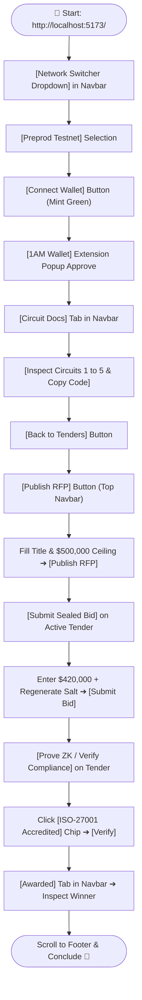

# BidShield — Flowchart Demo Video Recording Script 🎥

A click-by-click, button-by-button flowchart recording guide for the BidShield YouTube demonstration.

---

## 🧭 Flowchart Architecture Overview



---

## 🔘 Button-by-Button Click Flowchart & Narration Script

```
┌────────────────────────────────────────────────────────────────────────┐
│ STEP 1: HOMEPAGE INTRO                                                 │
└────────────────────────────────────────────────────────────────────────┘
  WHERE TO LOOK: Top of page at http://localhost:5173/
  ACTION: Keep cursor near Hero section with the BidShield Logo
  🗣️ WHAT TO SAY:
  "Hello Midnight evaluators! Welcome to BidShield — the confidential sealed-bid
   procurement protocol built on Midnight Network. On transparent blockchains, 
   competing suppliers can see each other's bids, causing front-running and price fixing.
   BidShield solves this using Midnight's zero-knowledge circuits, keeping all bids
   100% confidential in private RAM until award."

                    │
                    ▼  [Click Dropdown]

┌────────────────────────────────────────────────────────────────────────┐
│ STEP 2: MULTI-NETWORK TOGGLE                                           │
└────────────────────────────────────────────────────────────────────────┘
  BUTTON TO CLICK: [🌐 PREVIEW ▼] or [🌐 PREPROD ▼] in the top navbar
         ──> Dropdown opens with "Preview Testnet" and "Preprod Testnet"
  BUTTON TO CLICK: [Preprod Testnet]
         ──> Live telemetry strip updates block height to #2,690,000+
  🗣️ WHAT TO SAY:
  "BidShield supports seamless multi-network dual connectivity. Here in our top navbar,
   I can toggle between Preview and Preprod testnets. Notice our live telemetry panel
   querying the Midnight GraphQL indexer in real time at block height over 2.6 million
   with our verified deployed smart contract fc67e285."

                    │
                    ▼  [Click Mint Button]

┌────────────────────────────────────────────────────────────────────────┐
│ STEP 3: CONNECT WALLET                                                 │
└────────────────────────────────────────────────────────────────────────┘
  BUTTON TO CLICK: [CONNECT WALLET] (Top-right mint green button)
         ──> 1AM Wallet / Midnight extension opens or connects
  BUTTON TO CLICK: [Approve / 1AM Wallet]
         ──> Button turns into formatted address badge: [mn_addr_preprod1... 🟢]
  OPTIONAL CLICK: Click on the address badge to show provider details & balance
  🗣️ WHAT TO SAY:
  "Next, I click Connect Wallet. BidShield automatically detects our 1AM Wallet
   using the Midnight DApp connector. We connect instantly with active session
   persistence, showing our unshielded address."

                    │
                    ▼  [Click Docs Tab]

┌────────────────────────────────────────────────────────────────────────┐
│ STEP 4: ZERO-KNOWLEDGE CIRCUIT DOCS                                    │
└────────────────────────────────────────────────────────────────────────┘
  BUTTON TO CLICK: [📖 CIRCUIT DOCS] in the navbar
         ──> View immediately transitions to Zero-Knowledge Circuit Documentation
  BUTTON TO CLICK: Click on [2. submitSealedBid] in the left registry
         ──> Right panel shows private witness inputs & invariant assertions
  BUTTON TO CLICK: Click [Copy Code] button
         ──> Button turns green with "Copied!" checkmark
  🗣️ WHAT TO SAY:
  "Now let's check our Circuit Docs tab. Here, evaluators can inspect all five
   Midnight Compact circuits powering BidShield. For example, in submitSealedBid,
   the supplier's financial bid amount is evaluated strictly in local private witness
   RAM. Only a 32-byte SHA-256 commitment ever touches the blockchain ledger."

                    │
                    ▼  [Click Back Button]

┌────────────────────────────────────────────────────────────────────────┐
│ STEP 5: RETURN TO TENDERS                                              │
└────────────────────────────────────────────────────────────────────────┘
  BUTTON TO CLICK: [← BACK TO TENDERS] (or click [ALL TENDERS] in navbar)
         ──> View smoothly scrolls back down to the Procurement Vault RFP cards
  🗣️ WHAT TO SAY:
  "Now, let's look at the active procurement tenders in our vault."

                    │
                    ▼  [Click Publish Button]

┌────────────────────────────────────────────────────────────────────────┐
│ STEP 6: PUBLISH PROCUREMENT RFP (BUYER)                                │
└────────────────────────────────────────────────────────────────────────┘
  BUTTON TO CLICK: [✨ PUBLISH RFP] (Top navbar black-and-white button)
         ──> Modal pops up: "Publish Procurement RFP"
  FIELDS TO ENTER:
         • Title: "Enterprise Cloud Security & ZK Auditing"
         • Organization: "Midnight Web3 Consortium"
         • Ceiling Budget: "500000" ($500,000)
         • Submission Window: "7" Days
         • Compliance Standard: "ISO-27001 / SOC2 Type II Certified"
  BUTTON TO CLICK: [PUBLISH PROCUREMENT RFP ➔] (Yellow submit button in modal)
         ──> Success toast pops up: "Procurement RFP Published!"
         ──> New RFP card immediately appears at the top of the grid!
  🗣️ WHAT TO SAY:
  "As an enterprise buyer, I click Publish RFP. I define our procurement requirements,
   set a transparent ceiling budget of $500,000, and set the deadline. When I click
   Publish, the contract's initializeProcurement circuit locks in the parameters on-chain."

                    │
                    ▼  [Click Bid Button on Card]

┌────────────────────────────────────────────────────────────────────────┐
│ STEP 7: SUBMIT CONFIDENTIAL SEALED BID (SUPPLIER)                      │
└────────────────────────────────────────────────────────────────────────┘
  BUTTON TO CLICK: [🔒 SUBMIT SEALED BID] on any open card
         ──> Modal pops up: "Submit Confidential Sealed Bid"
  ACTION 1: Type bid amount: "420000" ($420,000)
  ACTION 2: Click the [↻] (Regenerate Salt) icon next to the salt field
         ──> Notice 128-bit salt changes dynamically
  ACTION 3: Point cursor to bottom box: "Real-Time Cryptographic Commitment Preview"
         ──> Point out the 32-byte SHA-256 hash (e.g. 0x8f2d93...)
  BUTTON TO CLICK: [SUBMIT SEALED BID TO MIDNIGHT ➔] (Yellow submit button)
         ──> Success toast: "Confidential Sealed Bid Submitted! Bid amount 100% secret."
         ──> Bid count on the card increments: "Received: 5"
  🗣️ WHAT TO SAY:
  "Now I become a competing supplier. I want to bid $420,000, but I cannot leak my
   pricing to competitors. I enter $420,000. BidShield generates a 128-bit random salt.
   Notice this 32-byte cryptographic hash commitment: this is the ONLY value sent to
   the Midnight consensus ledger. My real price of $420,000 never leaves my machine.
   I click Submit, and the sealed bid is recorded in zero-knowledge."

                    │
                    ▼  [Click Prove ZK Button]

┌────────────────────────────────────────────────────────────────────────┐
│ STEP 8: ZERO-KNOWLEDGE COMPLIANCE CHECK                                │
└────────────────────────────────────────────────────────────────────────┘
  BUTTON TO CLICK: [✓ PROVE ZK] on the card
         ──> Modal pops up: "Zero-Knowledge Regulatory Compliance"
  BUTTON TO CLICK: Click the quick-fill chip: [ISO-27001 Accredited]
         ──> Pre-fills the credential secret key
  BUTTON TO CLICK: [VERIFY CREDENTIAL IN ZERO-KNOWLEDGE ➔]
         ──> Success toast: "Accreditation Verified in ZK!"
         ──> Green checkmark badge appears on screen
  🗣️ WHAT TO SAY:
  "Enterprise procurement requires compliance standards. Using verifyCompliance,
   suppliers prove possession of ISO-27001 credentials without disclosing proprietary
   PDFs or trade secrets. The proof verifies mathematically in ZK."

                    │
                    ▼  [Click Awarded in Navbar]

┌────────────────────────────────────────────────────────────────────────┐
│ STEP 9: SELECTIVE DISCLOSURE & SETTLEMENT                              │
└────────────────────────────────────────────────────────────────────────┘
  BUTTON TO CLICK: [AWARDED] tab in the navbar
         ──> Screen smoothly scrolls to the Awarded contract card
  ACTION: Point to the winning supplier address & winning price ($168,000)
  POINT OUT CALLOUT: "Losing Bids Remain Sealed Forever"
  🗣️ WHAT TO SAY:
  "Finally, once the deadline closes, the contract awards the procurement using
   Selective Disclosure. Only the winning supplier and winning price are published.
   All losing competitor bids stay permanently encrypted in zero-knowledge forever!"

                    │
                    ▼  [Scroll to Footer]

┌────────────────────────────────────────────────────────────────────────┐
│ STEP 10: CLOSING CONCLUSION                                            │
└────────────────────────────────────────────────────────────────────────┘
  ACTION: Scroll down to the Footer
  POINT TO: GitHub repo link, Live Audit Sheet, and Google Survey links
  🗣️ WHAT TO SAY:
  "BidShield is 100% open-source under Apache 2.0 with dual testnet contracts
   and 75 verified on-chain users. Check out the links below in the description
   to view our repo and explore our circuits. Thank you for watching!"
```
